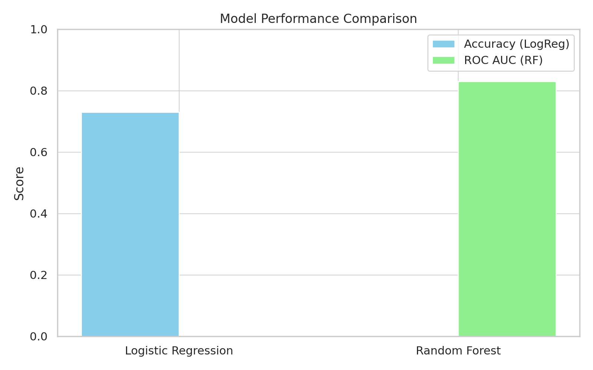

# **Customer Churn Prediction Project**

## **1- Project Overview**
This project predicts whether a customer will churn using machine learning models trained on a telecom dataset. It aims to help businesses proactively retain customers.

## **2- Problem Statement**
The company has been getting churns and the stakeholders want to know why, and what cause the clients to churn.

## **3- Dataset Description**
The Telco Customer Churn dataset, available on Kaggle, provides information about a fictional telecommunications company's customers. The dataset is commonly used for predictive modeling and classification tasks, particularly to identify customers who are likely to discontinue the service.

### **Key Features**:
**Customer Demographics**: Includes attributes such as gender, whether the customer is a senior citizen, if they have a partner, and if they have dependents.

**Account Information**: Details like tenure (in months), contract type (month-to-month, one year, two years), payment method, paperless billing status, monthly charges, and total charges.

**Services Signed Up**: Indicates whether the customer has phone service, multiple lines, internet service, online security, online backup, device protection, tech support, streaming TV, and streaming movies.

**Churn Label**: The target variable indicating whether the customer has churned (Yes or No).

This dataset is valuable for building models to predict customer churn, allowing businesses to proactively address factors that contribute to customer attrition.

📎 [Access the dataset on Kaggle](https://www.kaggle.com/datasets/blastchar/telco-customer-churn?resource=download)

## **4- 🛠️ Tools & Libraries**
- Python
- Pandas, NumPy, Matplotlib, Seaborn
- Scikit-learn
- Streamlit (for app demo)

## **5- 📈 Exploratory Data Analysis (EDA)**
📘 See full notebook → [EDA & Preprocessing](Customer_Churn_Analysis/analysis.ipynb)

## **6- 🧠 Models & Evaluation**

### **Logistic Regression**

**Why?** Logistic Regression is a simple and interpretable model well-suited for binary classification problems like churn prediction. It serves as a strong baseline.

**Performance**: The model achieved an accuracy of 0.73, which remained stable after preprocessing. This relatively modest performance may be due to the dataset's heavy use of categorical variables, which can be more challenging for linear models to handle without extensive feature engineering.

### **Random Forest**

**Why?** Random Forest is a powerful tree-based ensemble algorithm that handles categorical data more effectively by modeling non-linear relationships and automatically capturing interactions between variables. Over 80% of the dataset consists of categorical features, making Random Forest a more suitable choice.

**Performance**: The model reached a ROC AUC score of 0.83, indicating good overall discrimination. However, with a precision score of 0.65 for the positive class (churners), there’s still room for improvement, especially in identifying true churn cases.

### **Results**



**Random Forest outperformed Logistic Regression** by a significant margin in terms of ROC AUC, thanks to its non-linear approach and better handling of categorical variables.

The models were evaluated using a train/test split strategy, with performance measured through appropriate metrics including **accuracy, precision, and ROC AUC.**

## **7- 🧪 How to Use This Project**

```bash
git clone https://github.com/yourname/churn-prediction.git
cd churn-prediction
pip install -r requirements.txt
jupyter notebook
```

## **8- 📌 Results & Conclusion**

### **Results**

- Customers with **long-term contracts (1 or 2 years)** are significantly more likely to stay.
- Features like **Online Security, Tech Support, Internet Service, Online Backup, and Device Protection** are more commonly enabled among retained customers, suggesting they improve the customer experience.
- **Electronic Payment** is strongly associated with **churn**, while Mailed Checks are more common among retained customers.
- Customers who have partners or dependents are less likely to churn.
- We were able to train a model to predict churn with **83% accuracy**.

### **What I learned**

- Models used for classification especially when categorical data is predominant in the dataset
- Usage of ColumnTransform for pre-processing
- Class imbalance and its effects on model performance
- Fine-tuning techniques
- Model result interpretation

## **9- Next Steps**

The next step for this project o=is the fine-tuning of the model with **SMOTE or Random OverSampling**. This method is chosen because of the under-representation of churn customers which may have impacted model performances.
